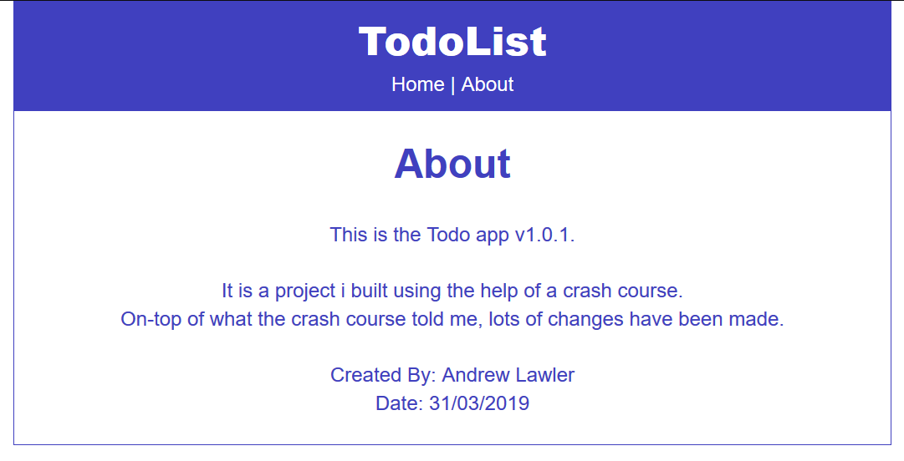

# React-Todo Application
I created this application using a React course i found online. This course helped me learn the basics of react and allowed me to create this app. 
I made changes when it comes to the css because the overall application from the course looked a bit boring.
## How to run
To run the files simply open terminal and run 'npm start'

